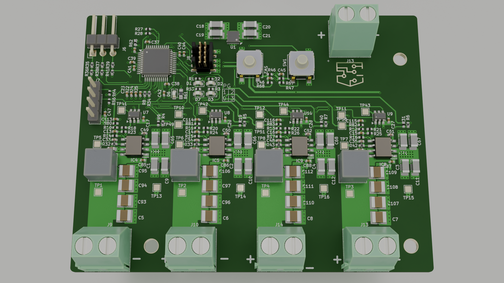

# battery-powered programmable power supply

A 4S Li-ion battery-powered programmable power supply module controlled by an STM32 MCU. Provides **4 independently programmable output channels** (1.8V–12V, ~2.53 mV/LSB resolution via TPS56637 DC-DC converters with DAC control), monitored via ADC telemetry and managed over I2C with per-channel enable. Serves as a general-purpose programmable power supply module.

